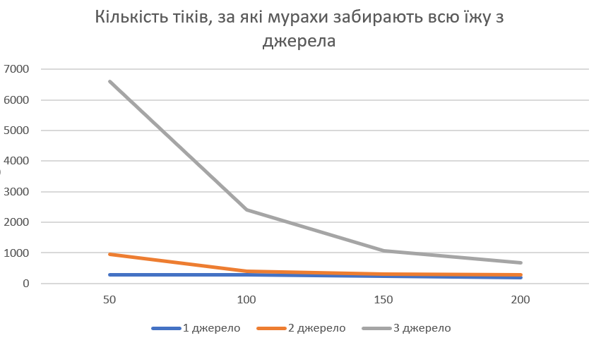
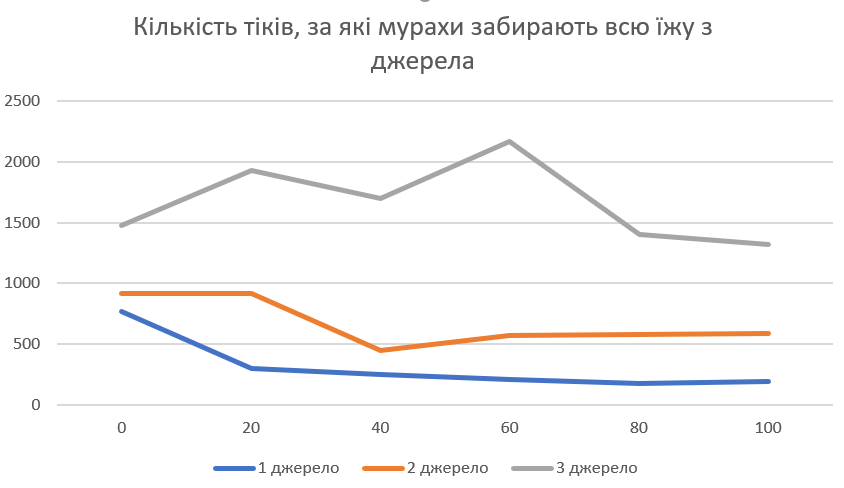
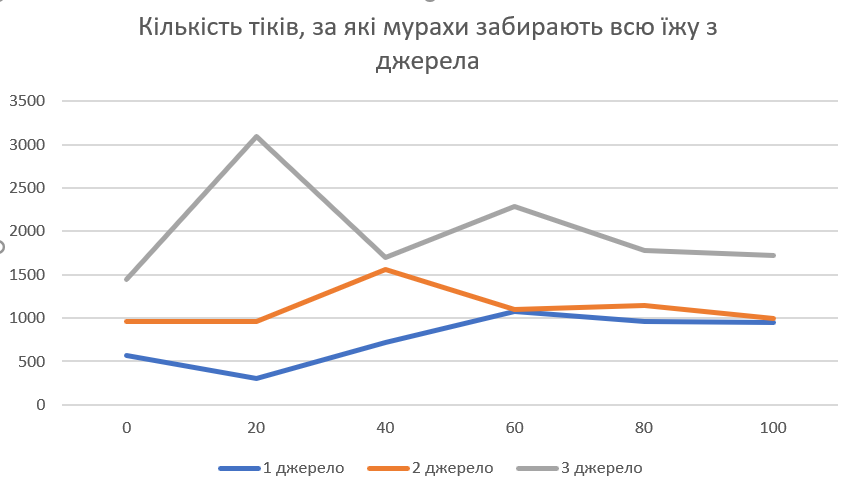

## Комп'ютерні системи імітаційного моделювання
## СПм-22-3, **Коломоєць Владислав Сергійович**
### Лабораторна робота №**1**. Опис імітаційних моделей та проведення обчислювальних експериментів

### Варіант 10, модель у середовищі NetLogo:
[Ants](https://www.netlogoweb.org/launch#http://www.netlogoweb.org/assets/modelslib/Sample%20Models/Biology/Ants.nlogo)

### Вербальний опис моделі:
Ця модель імітує колонію мурах, яка збирає їжу з різних джерел. Коли мураха знаходить шматок їжі, вона несе їжу назад у гніздо, залишаючи феромон під час руху. Коли інші мурахи «нюхають» феромон, вони слідують за ним до їжі або гнізда. Чим більше мурах несуть їжу до гнізда, тим більше вони зміцнюють феромонний слід. Мурахи вибирають оптимальні маршрути на основі залишених феромонів і допомагають один одному збирати ресурси. Швидкість випаровування феромонів та їх дифузія впливають на стійкість шляхів до джерел їжі.

### Керуючі параметри:
- **population** - параметр, який визначає початкову кількість мурах у колонії. Він впливає на загальну кількість мурах у середовищі та на швидкість збору їжі, оскільки більша кількість мурах може прискорити пошук та збір ресурсів.
- **diffusion-rate** - параметр, який відображає швидкість розповсюдження феромонів, які мурахи залишають за собою. Чим більше, тим далі від мурах розпосюджується слід.
- **evaporation-rate** - параметр визначає швидкість випаровування феромонів з середовища. Він впливає на те, як швидко феромони зникають з середовища, що може впливати на стійкість шляхів до їжі. Висока швидкість випаровування може призвести до швидшого зникнення шляхів, тоді як низька швидкість може призвести до накопичення феромонів та стійкості шляхів протягом тривалого часу;

### Внутрішні параметри:
- **chemical** - кількість хімічного речовини на даному патчі. Використовується для позначення слідів феромонів, залишених мурахами.
- **food** - кількість їжі на даному патчі. Може бути 0, 1 або 2, що вказує на наявність їжі на патчі.
- **nest?** - логічне значення, яке вказує, чи знаходиться даний патч у місці гнізда мурашиного вулика.
- **nest-scent** - число, яке вище ближче до гнізда. Використовується для визначення сили запаху гнізда, який відбивається від патчів.
- **food-source-number** - номер (1, 2 або 3), який ідентифікує джерела їжі. Використовується для розрізнення трьох джерел їжі у середовищі.

### Показники роботи системи:
- **Food-in-pile1**, **Food-in-pile2**, **Food-in-pile3**: Споживання їжі. Кількість їжі, яка залишилась в кожному джерелі їжі. Їх всього 3. Кожне з них на різній відстані від мурашника. Кольори ліній на графіку збігаються з кольорами джерел їжі.

### Примітки:
- Мурахи завжди знають, як дійти до гнізда.
- Колонія мурашок зазвичай використовує джерело їжі по порядку, починаючи з їжі, яка знаходиться найближче до гнізда, і закінчуючи їжею, що знаходиться найдальше від гнізда.
- Кількість їжі в джерелах завжди випадкова, але коливається навкого значення 100.

### Недоліки моделі:
- **Спрощена умова руху мурах**: у моделі використовується спрощена логіка руху мурах, яка базується на попередніх умовах та обмежених правилах, що може не враховувати всі аспекти реального поведінки мурах. Наприклад, деякі ускладнення, такі як взаємодія з іншими видами, врахування фізичних перешкод та багато інших факторів, можуть бути не враховані.
- **Обмежена умова дифузії феромонів**: умови дифузії феромонів в моделі можуть бути дещо спрощеними, що може призвести до нереалістичних результатів у плані впливу феромонів на поведінку мурах. Наприклад, врахування більш складних паттернів дифузії та їх взаємодії з фізичним середовищем може бути необхідним для більш точного моделювання.
- **Відсутність соціальних аспектів**: модель не враховує соціальних аспектів поведінки мурах, таких як взаємодія між окремими мурахами, ділення ресурсів та інші форми соціальної взаємодії. Це може призвести до недостатнього уявлення про колективну поведінку мурах у великій колонії.
- **Спрощений пошук гнізда**: У цьому проекті мурахи використовують «хитрість», щоб знайти дорогу назад до гнізда: вони слідують «запаху гнізда». Справжні мурахи використовують різні підходи, щоб знайти дорогу назад до гнізда.
- **Обмеженість налаштування симуляції**: неможливо пермістити, або хоча б змінити кількість джерел їжі і мурашників.
- **Їжа майже не грає ролі**: мурахи дарма збирають їжу, вона ніяк не впливає на життя колонії. В реальному житті, чим більшеу мурах їжі, тим більше їх у гнізді. В даній симуляції кількість, або навіть повна відсутність їжі ніяк не впливає на мурашник.

## Обчислювальні експерименти
### 1. Вплив кількості мурах на швидкість збору кожного джерела їжі
Досліджується залежність кількості мурах в колонії на швидкість та ефективність збору їжі.
Експерименти проводяться при 50-200 мурашках, з кроком 50, усього 4 симуляцій.  
Інші керуючі параметри мають значення за замовчуванням:
- **diffusion-rate**: 50
- **evaporation-rate**: 10

Кількість тіків, за які мурахи забирають всю їжу з джерела
<table>
<thead>
<tr><th>Кількість мурах</th><th>1 джерело</th><th>2 джерело</th><th>3 джерело</th></tr>
</thead>
<tbody>
<tr><td>50</td><td>280</td><td>950</td><td>6600</td></tr>
<tr><td>100</td><td>280</td><td>400</td><td>2400</td></tr>
<tr><td>150</td><td>230</td><td>300</td><td>1080</td></tr>
<tr><td>200</td><td>190</td><td>275</td><td>670</td></tr>
</tbody>
</table>

За цими даними видно, що при збільшенні кількості мурах збільшує швидкість збору їжі: Якщо порівнювати кількість тіків, які потрібні для забору їжі з різною кількістю мурах, видно, що колонія з більшою кількістю мурах збирає їжу швидше, що доволі логічно, але графік змінюється не зовсім лінійно. Це може бути пов'язано з тим, що більша кількість мурах дозволяє формувати більше численні та стійкі хімічні сліди до джерел їжі, особливо до останнього джерела.

### 2. Вплив дифузії феромонів на швидкість збору кожного джерела їжі
Досліджується залежність сили дифузії на швидкість та ефективність збору їжі.
Експерименти проводяться при 0-100 значення дифузії, з кроком 20, усього 6 симуляцій.  
Інші керуючі параметри мають значення за замовчуванням:
- **population**: 20
- **evaporation-rate**: 10

Кількість тіків, за які мурахи забирають всю їжу з джерела
<table>
<thead>
<tr><th>Значення дифузії</th><th>1 джерело</th><th>2 джерело</th><th>3 джерело</th></tr>
</thead>
<tbody>
<tr><td>0</td><td>770</td><td>920</td><td>1480</td></tr>
<tr><td>20</td><td>300</td><td>920</td><td>1930</td></tr>
<tr><td>40</td><td>250</td><td>450</td><td>1700</td></tr>
<tr><td>60</td><td>210</td><td>570</td><td>2170</td></tr>
<tr><td>80</td><td>180</td><td>580</td><td>1400</td></tr>
<tr><td>100</td><td>190</td><td>585</td><td>1320</td></tr>
</tbody>
</table>

- За результатами експерименту видно, що зі збільшенням сили дифузії, кількість тіків (часу), необхідних для збору їжі, зменшуєється для всіх кількостей джерел їжі. Це означає, що при низькій силі дифузії мурахам потрібно більше часу для збору їжі.
- Чим менша дифузія, тим рівномірніше мурахи розподіляються по джерелах їжі, адже шляхи до їжі стають хоч і вузькими, зате точнішими і мурахам легше провести найоптимізованіший шлях від їжі до гнізда.
- З іншого боку, чим більша дифузія, тим легше мурахам знайти джерело їжі по ферономах, і майже всі мурахи йдуть до найближчого джерела їжі, збираючи їх по черзі.
- Можу зробити висновок, що збільшення сили дифузії може зробити розподіл мурах більш випадковим, тоді як зменшення сили дифузії може покращити координацію та точність, але може затримати пошук їжі та швидкість збору їжі.

### 3. Вплив швидкість випаровування феромонів з середовища на швидкість збору кожного джерела їжі
Досліджується залежність швидкості випаровування феромонів з середовища на швидкість та ефективність збору їжі.
Експерименти проводяться при 0-100 значення випаровування, з кроком 20, усього 6 симуляцій.  
Інші керуючі параметри мають значення за замовчуванням:
- **population**: 20
- **diffusion-rate**: 50
Кількість тіків, за які мурахи забирають всю їжу з джерела
<table>
<thead>
<tr><th>Значення випаровування</th><th>1 джерело</th><th>2 джерело</th><th>3 джерело</th></tr>
</thead>
<tbody>
<tr><td>0</td><td>570</td><td>960</td><td>1450</td></tr>
<tr><td>20</td><td>300</td><td>960</td><td>3100</td></tr>
<tr><td>40</td><td>720</td><td>1560</td><td>1700</td></tr>
<tr><td>60</td><td>1080</td><td>1100</td><td>2290</td></tr>
<tr><td>80</td><td>960</td><td>1150</td><td>1780</td></tr>
<tr><td>100</td><td>950</td><td>1000</td><td>1720</td></tr>
</tbody>
</table>

- Зі збільшенням швидкості випаровування феромонів з середовища спостерігається зменшення швидкості збору їжі. Це може бути пов'язано з тим, що зі збільшенням швидкості випаровування феромонів мурахи втрачають можливість відстежувати їх на шляху до джерела їжі.
- Ця залежність не є лінійною: зі збільшенням значення випаровування, зменшення швидкості збору їжі є найвиразнішим при низьких значеннях випаровування і менш виразним при високих значеннях випаровування. Тобто при значенні випаровування 50+ це майже ніяк не впливає на результат, адже чутливість мурах доволі низька.
Ефективність збору їжі з різних джерел:
- Для джерела 2 швидкість збору їжі залишається практично незмінною при зміні значення випаровування. Це може свідчити про те, що мурахи успішно впливають на цей джерело незалежно від кількості випаровування феромонів.
- Для джерел 1 і 3 спостерігається більше змін в швидкості збору їжі при зміні значення випаровування. Для джерела 1 швидкість збору зменшується зі збільшенням випаровування, в той час як для джерела 3 вона спершу зростає, а потім зменшується.
